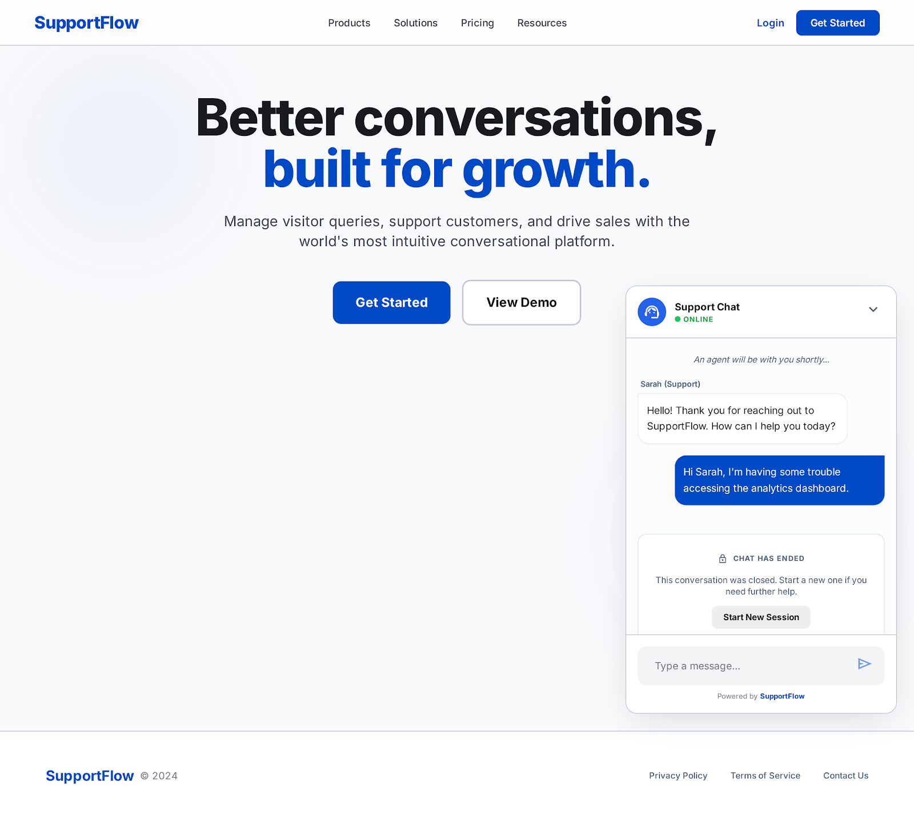

# Project Requirements — Stupid & Slow Pizza (Customer Support Chat)

## Overview

A real-time customer support chat application for **Stupid & Slow Pizza** — a pizza delivery company so bad that the only thing visitors can do on the website is open a support ticket and complain.

Visitors fill in their name to open a ticket. One fixed admin account handles all incoming chats.

**Tech Stack:** Astro (frontend) · Node.js + Express (backend) · Socket.io (real-time) · Tailwind CSS

---

## User Types

| User | Auth required | Description |
|---|---|---|
| Visitor | No | Anyone who wants to open a support ticket |
| Admin | Yes (session cookie) | Single fixed admin account that handles all chats |

**Default admin account (pre-seeded in server memory):**
- Email: `admin@admin.com`
- Password: `admin`

---

## Pages

| Route | Page | Access |
|---|---|---|
| `/` | Home page | Public |
| `/admin/login` | Admin login | Public |
| `/chat` | Chat page | Public (visitor) / Protected view (admin) |

---

## Feature Requirements

### 1. Home Page (`/`)



- [ ] Display the brand name **"Stupid & Slow Pizza"**
- [ ] Show the headline: **"Having problems?"**
- [ ] Show an **"Open a Ticket"** button
  - Clicking the button opens a dialog or a new page with a form
  - Form fields: **First Name** and **Last Name**
  - On submit, create a new chat session and redirect to `/chat`
- [ ] Show a small **"Admin Login"** button (subtle, not prominent)

### 2. Admin Login (`/admin/login`)


- [ ] Admin can log in with email + password
- [ ] Session is created using a session cookie
- [ ] Admin can log out (session is destroyed)
- [ ] All `/admin/*` routes redirect to `/admin/login` if not authenticated
- [ ] No registration page — only one fixed admin account exists

### 3. Chat Page (`/chat`)


#### Visitor view
- [ ] Visitor sees their own chat thread
- [ ] Visitor can type and send messages
- [ ] Visitor receives admin replies in real-time
- [ ] Show status message: "Connecting you to an agent..."
- [ ] Show **"Chat has ended"** notice when admin closes the ticket
- [ ] Visitor **cannot** see other chats or mark a ticket as closed
- [ ] Visitor **has no chat history** — each new session starts fresh

#### Admin view (same `/chat` route, protected)
- [ ] Admin sees a list of **all tickets** (open and closed) in a sidebar
  - Display: visitor badge (initials), visitor full name, latest message preview, timestamp
- [ ] Admin clicks a ticket to open and read the **full message history**
- [ ] Admin can type and send a reply in real-time
- [ ] Admin can mark a ticket as **Closed** (status: `open` → `closed`)
- [ ] New incoming tickets appear in the list instantly (no page refresh)
- [ ] Show the logged-in admin name at the bottom of the sidebar

#### Visitor badge
- Visitor's initials are used as a badge instead of a profile picture
- Example: **Sarah Miller** → badge **"SM"**
- The badge is shown in the admin's ticket list and in the chat header

---

## Real-Time Architecture (Socket.io)

### Overview

The frontend sends all data mutations (start chat, send message, close chat) via **REST API**.
The backend processes each request, updates the in-memory data, and then **broadcasts a Socket.io event** to notify other connected clients in real-time.

```
Frontend  ──── REST request ──────→  Backend
                                         │
                                         ├─ updates in-memory data
                                         │
                                         └─ emits Socket.io event ──→  Other clients
```

- **REST** — used for all data mutations
- **Socket.io** — used for server-to-client push notifications only

---

### Connection Events (Client → Server, on page load)

| Event | Sent By | Payload | Purpose |
|---|---|---|---|
| `visitor:join` | Visitor | `{ chatId }` | Join the visitor's specific chat room |
| `admin:join` | Admin | `{ adminId }` | Join the admin broadcast room |

---

### Push Notification Events (Server → Client)

| Event | Sent To | Trigger | Payload |
|---|---|---|---|
| `chat:new` | Admin | Visitor opens a new ticket | `{ chatId, visitorName, initials, createdAt }` |
| `message:new` | Admin or Visitor | Either side sends a message | `{ chatId, from, text, time }` |
| `chat:closed` | Visitor | Admin closes the ticket | `{ chatId }` |

---

## Out of Scope (Intentionally Excluded)

- Admin registration page
- Visitor chat history between sessions
- Analytics page
- Team management page
- Canned responses
- Broadcast feature
- Visitor IP / location lookup
- Reports section
- Transfer chat between admins

---

## Optional (Add Only If Time Allows)

- [ ] "Agent is typing..." indicator (Socket.io)
- [ ] Unread message badge on admin ticket list

---

## API Endpoints

See `openapi/openapi.yaml` for the full API design.

---

## Project Priorities

1. Project setup and repo structure
2. Admin login + logout (session cookie auth)
3. Protected routes for `/admin/*`
4. Home page UI + "Open a Ticket" form
5. Chat page UI (visitor view + admin view)
6. Socket.io real-time messaging
7. UI polish and responsive design
8. Testing and presentation preparation
