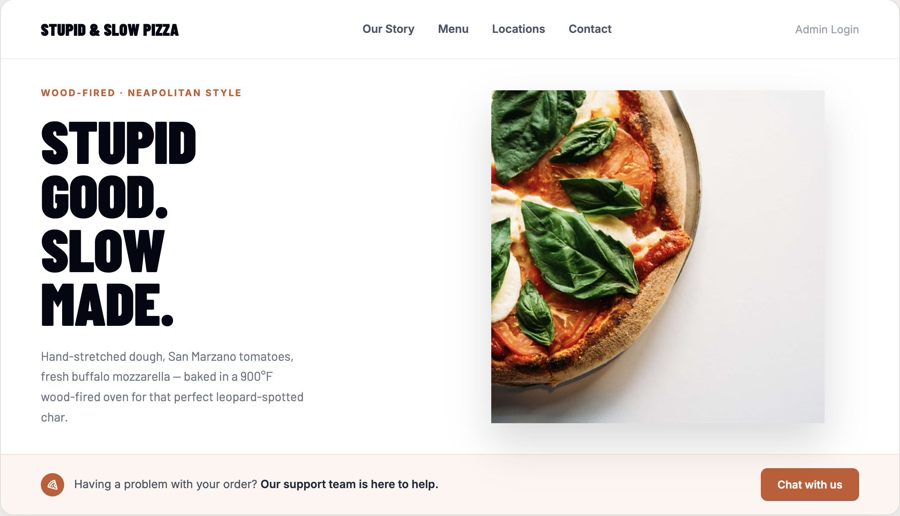
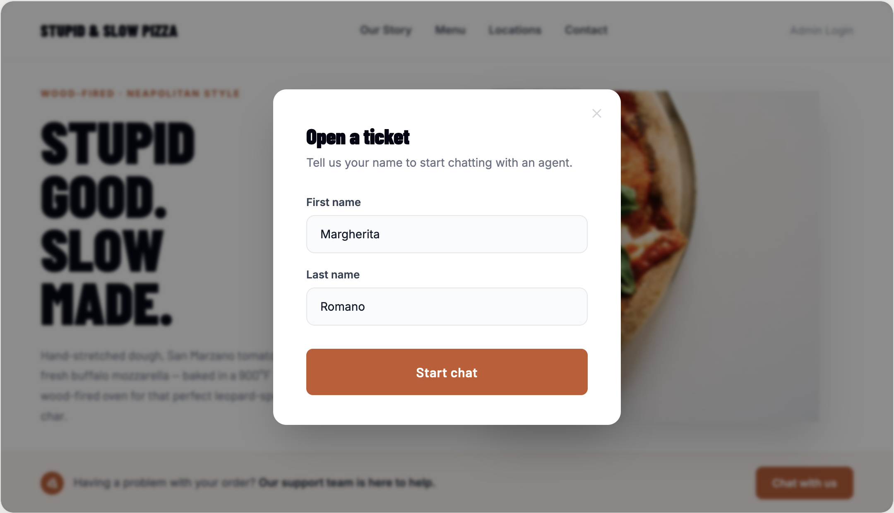
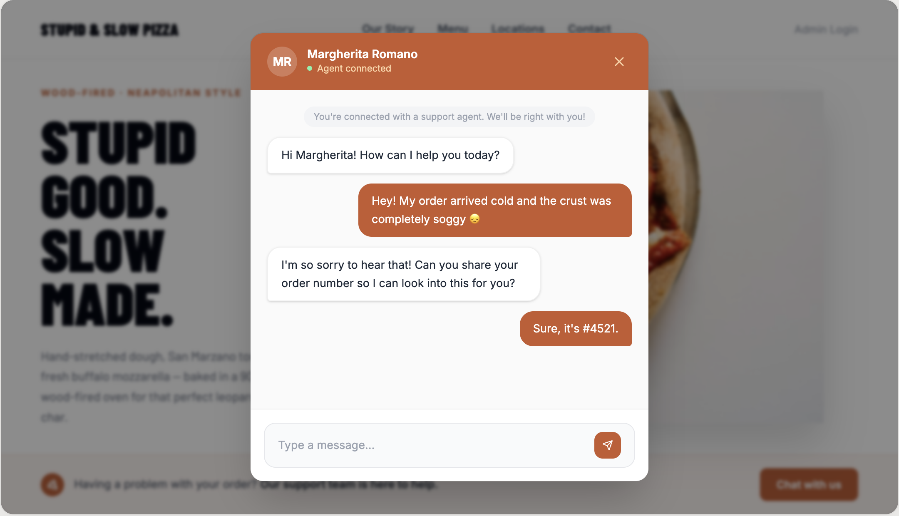
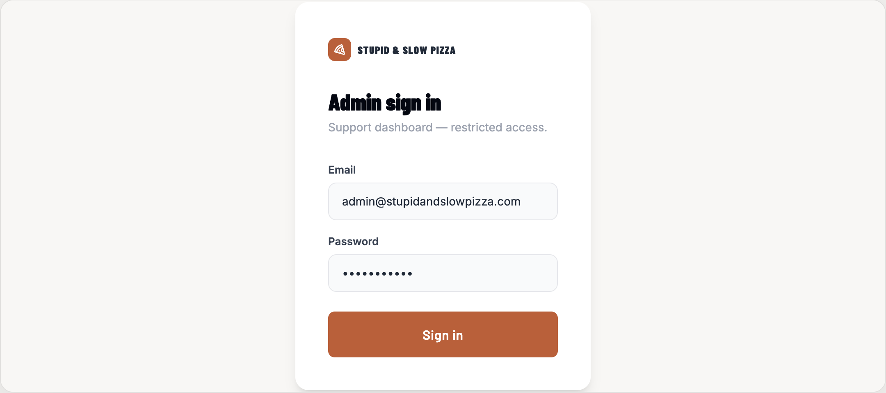
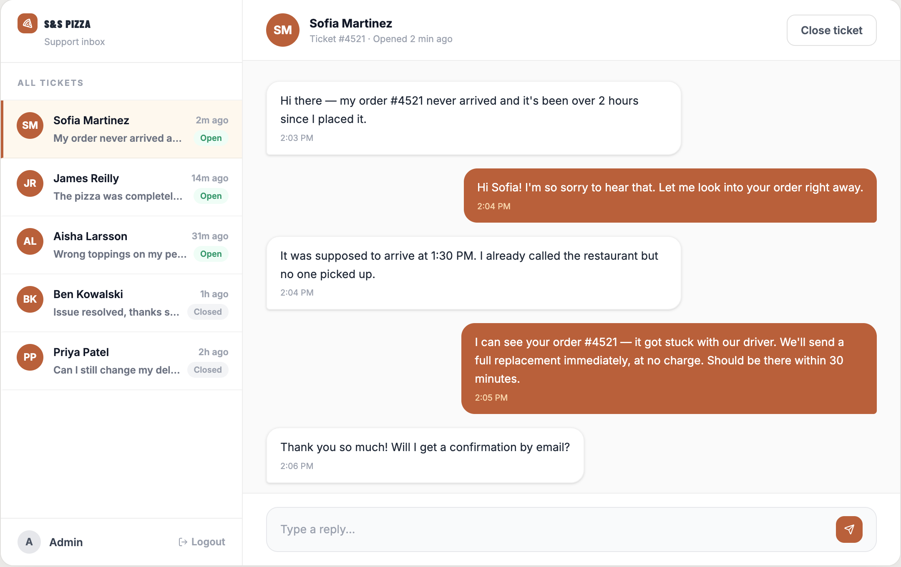

# Project Requirements — Stupid & Slow Pizza (Customer Support Chat)

## Overview

A real-time customer support chat application for **Stupid & Slow Pizza**, a pizza
delivery company. Visitors who have a problem with their order open a support
ticket and chat with a support agent in real time. One fixed admin account
handles all incoming chats from a support dashboard.

> Note: "Stupid & Slow Pizza" is only the brand name. The site is presented as a
> normal, good-looking pizza restaurant — the name is not meant to drive a
> "deliberately bad product" concept.

Visitors enter their first and last name to open a ticket. No visitor account or
login is required.

**Tech Stack:** Astro (frontend) · Node.js + Express (backend) · Socket.io (real-time) · Tailwind CSS

---

## User Types

| User | Auth required | Description |
|---|---|---|
| Visitor | No | Anyone who wants to open a support ticket |
| Admin | Yes (session cookie) | Single fixed admin account that handles all chats |

**Default admin account (pre-seeded in server memory):**
- Email: `admin@admin.com`
- Password: `admin`

---

## Visitor Flow (important)

The **visitor never navigates to a separate chat URL**. The entire visitor
experience happens on the home page (`/`) through modal UI:

```
Home page (/)
   │
   ├─ click the support CTA button
   │
   ├─ "Register name" modal  → enter First / Last name
   │
   └─ "Chat" modal           → chat with the agent in real time
```

There is **no `/chat` route for visitors.** The name form and the chat are both
modals layered over the home page.

---

## Pages

The app has **3 routes**. Note that `/chat` is **admin-only** — visitors do not
use it.

| Route | Page | Access |
|---|---|---|
| `/` | Home page (+ visitor modals) | Public |
| `/admin/login` | Admin login | Public |
| `/chat` | Admin support dashboard | **Admin only** (protected) |

> The visitor's "register name" and "chat" experiences are modals on `/`, not
> separate routes.

---

## Visitor Identity & Session Management

This section captures the decisions made about how a visitor is identified across
visits. These rules are intentional and should not be changed without team
agreement.

### What is stored in localStorage

The visitor's **name only** is remembered — never the conversation. Stored under
a single key `visitor`:

| Property | Example | Purpose |
|---|---|---|
| `firstName` | `"Sarah"` | Skip the name form on return, show greeting |
| `lastName` | `"Miller"` | Same |
| `expiresAt` | `Date.now() + 30 days` | Self-managed expiry (see below) |

- `localStorage` has no built-in expiry, so we store `expiresAt` (now + 30 days)
  and check it ourselves on read. If expired, clear the entry and treat the
  visitor as new.
- **No visitor ID is generated.** Since the admin treats every chat as a brand-new
  ticket (see below), there is no need to identify the same person across visits,
  so storing an ID would be unused data.
- **`chatId` is never stored in localStorage.** It lives only in volatile
  front-end state and is fine to lose on reload.

### Identifier rules

- **1 inquiry = 1 `chatId`** (strict). The same person opening three inquiries
  produces three `chatId`s. This is the backbone of how tickets, Socket.io rooms,
  and messages are linked — do not break it.
- `chatId` is issued by the server and held only in front-end memory.

### Visitor experience

- **First visit:** no `visitor` entry (or expired) → show the register-name
  modal → save on submit.
- **Return visit (within 30 days):** skip the name form, show
  "Welcome back, {firstName}". The chat still starts **fresh** — past
  conversations are not shown or remembered.
- **From the admin's perspective:** every chat is just a new ticket. The admin
  does not identify returning visitors.

### Closing the chat modal vs. closing a ticket (important)

- Closing the chat modal (the visitor leaving the chat) is **not** the same as the
  ticket being resolved.
- If the visitor closes the modal mid-conversation — whether by the X button or by
  closing the browser entirely — the ticket status is **not** changed. It stays
  `open`.
  - Rationale: closing via the X button is detectable, but closing the whole
    browser is not. Tying status to "how the visitor left" would make the ticket's
    fate depend on a technical accident. For consistency, neither path closes the
    ticket.
- Because progressive recovery of an in-progress chat is intentionally **not**
  implemented, if the visitor leaves and re-opens, a **new ticket** (new `chatId`)
  is created. The previous, abandoned ticket remains `open` in the admin list.
- Cleanup of abandoned `open` tickets is a **manual** admin action. No
  auto-closing is in scope.

---

## Feature Requirements

### 1. Home Page (`/`)



- [ ] Display the brand name **"Stupid & Slow Pizza"**
- [ ] Present a clean, single-view pizza-restaurant hero (headline + pizza
      photography). Keep it focused — no long multi-section scrolling page.
- [ ] Show a support call-to-action (e.g. a "Chat with us" / "Open a Ticket"
      button within the hero area) that opens the visitor flow as a modal.
- [ ] Show a small **"Admin Login"** link (subtle, not prominent) in the top bar.

### 2. Visitor — Register Name Modal (on `/`)



- [ ] Opens over a dimmed background overlay when the support CTA is clicked.
- [ ] Title "Open a ticket", helper text, **First name** / **Last name** inputs,
      and a **Start chat** button. Small close (X) icon top-right.
- [ ] On submit, create a new chat session (server issues a new `chatId`) and
      switch to the chat modal.
- [ ] **First visit:** shows this name form.
- [ ] **Return visit (name remembered):** shows a "Welcome back, {firstName}"
      state instead, letting the visitor start a new chat without re-entering the
      name.

### 3. Visitor — Chat Modal (on `/`)



- [ ] Replaces the register-name modal in place (still a modal on `/`, no route
      change).
- [ ] Chat header shows the visitor's initials badge, full name, and an
      "Agent connected" status, with a close (X) icon.
- [ ] Visitor can type and send messages.
- [ ] Visitor receives admin replies in real-time.
- [ ] Show a status message while connecting (e.g.
      "You're connected with a support agent. We'll be right with you!").
- [ ] Show a **"Chat has ended"** notice when admin closes the ticket.
- [ ] Visitor **cannot** see other chats or mark a ticket as closed.
- [ ] Visitor **has no chat history** — each new session starts fresh.
- [ ] There is **no visitor "Resolve" button**. Closing a ticket is admin-only.

### 4. Admin Login (`/admin/login`)



- [ ] Admin can log in with email + password
- [ ] Session is created using a session cookie
- [ ] Admin can log out (session is destroyed)
- [ ] All `/admin/*` routes and the `/chat` dashboard redirect to `/admin/login`
      if not authenticated
- [ ] No registration page — only one fixed admin account exists

### 5. Admin Support Dashboard (`/chat`, protected)



- [ ] This route is **admin-only**. Visitors never reach it.
- [ ] Two-panel layout only (kept intentionally simple):
  - Left: a list of **all tickets** (open and closed)
  - Main: the selected conversation
- [ ] The left sidebar has **no extra navigation** (no Analytics / Menu / Admin /
      Settings items) — it is the ticket list only.
- [ ] There is **no right-hand "Customer Details" panel** (no email / orders /
      lifetime value / internal notes).
- [ ] Each ticket item shows: visitor **initials badge**, **full name**, a one-line
      **latest-message preview**, a **timestamp**, and a **status pill**
      (`Open` / `Closed`).
- [ ] Admin clicks a ticket to open and read the **full message history**.
- [ ] Chat header shows the visitor badge/name, ticket reference, and a
      **"Close ticket"** button.
- [ ] Admin can type and send a reply in real-time.
- [ ] Admin can mark a ticket as **Closed** (status: `open` → `closed`).
- [ ] New incoming tickets appear in the list instantly (no page refresh).
- [ ] Show the logged-in admin name and a **Logout** action at the bottom of the
      sidebar.

#### Visitor badge

- Visitor's initials are used as a badge instead of a profile picture
- Example: **Sarah Miller** → badge **"SM"**
- The badge is shown in the admin's ticket list and in the chat header

---

## Status Model

- Each chat record has `status: 'open' | 'closed'`.
- Only the **admin** can move a ticket to `closed`.
- Visitors cannot close or resolve a ticket.
- The visitor leaving the modal/browser does **not** change status (stays `open`).

---

## Pages & Components (Frontend structure)

### Pages / routes (3)

- `src/pages/index.astro` — Home (`/`); hosts the visitor register-name and chat
  modals
- `src/pages/admin/login.astro` — Admin login (`/admin/login`)
- `src/pages/chat.astro` — Admin support dashboard (`/chat`), protected

### Components

**Home (`/`) — visitor flow**
- `SupportCta` — the hero button that opens the visitor flow
- `VisitorModal` — container that switches between the states below:
  - `NameForm` — first visit (First / Last name)
  - `WelcomeBack` — return visit ("Welcome back, …")
  - `VisitorChat` — the in-modal chat (header, message thread, input)

**Admin login**
- `LoginForm` — email + password, with error display

**Admin dashboard (`/chat`)**
- `TicketList` — sidebar ticket list
- `TicketListItem` — badge, name, latest-message preview, timestamp, status pill
- `ChatHeader` (+ Close button) — header of the open ticket
- `AdminSidebarFooter` — logged-in admin name + logout

**Shared (used by both visitor chat and admin chat)**
- `MessageList` — message thread area
- `MessageBubble` — one message (own vs. other styled differently)
- `MessageInput` — input box + send button
- `SystemNotice` — "Connecting…", "Chat has ended", etc.
- `VisitorBadge` — initials badge (e.g. "SM")
- `Layout` — common page shell (optional, for consistency)

---

## Real-Time Architecture (Socket.io)

### Overview

The frontend sends all data mutations (start chat, send message, close chat) via
**REST API**. The backend processes each request, updates the in-memory data, and
then **broadcasts a Socket.io event** to notify other connected clients in
real-time.

```
Frontend  ──── REST request ──────→  Backend
                                         │
                                         ├─ updates in-memory data
                                         │
                                         └─ emits Socket.io event ──→  Other clients
```

- **REST** — used for all data mutations
- **Socket.io** — used for server-to-client push notifications only

### Connection Events (Client → Server)

| Event | Sent By | When | Payload | Purpose |
|---|---|---|---|---|
| `visitor:join` | Visitor | When the chat modal opens | `{ chatId }` | Join the visitor's specific chat room |
| `admin:join` | Admin | On dashboard load | `{ adminId }` | Join the admin broadcast room |

### Push Notification Events (Server → Client)

| Event | Sent To | Trigger | Payload |
|---|---|---|---|
| `chat:new` | Admin | Visitor opens a new ticket | `{ chatId, visitorName, initials, createdAt }` |
| `message:new` | Admin or Visitor | Either side sends a message | `{ chatId, from, text, time }` |
| `chat:closed` | Visitor | Admin closes the ticket | `{ chatId }` |

---

## Data Model (in server memory)

No database. Data is stored in memory and may reset on server restart.

```
chats: [
  {
    chatId,                 // 1 inquiry = 1 chatId
    firstName,
    lastName,
    initials,               // e.g. "SM"
    status: 'open' | 'closed',
    createdAt,
    messages: [
      { from: 'visitor' | 'admin', text, time }
    ]
  }
]
```

---

## Out of Scope (Intentionally Excluded)

- A separate visitor chat route/page (visitor chat is a modal on `/`)
- Admin registration page
- Visitor chat history between sessions
- Visitor "resolve / close ticket" action
- Generating / storing a visitor ID
- Recovering an in-progress chat after the modal/browser is closed
- Auto-closing abandoned tickets
- Admin-side dashboard navigation (Analytics, Menu, Admin, Settings)
- Right-hand "Customer Details" panel
- Analytics page
- Team management page
- Canned responses
- Broadcast feature
- Visitor IP / location lookup
- Reports section
- Transfer chat between admins

---

## Optional (Add Only If Time Allows)

- [ ] "Agent is typing..." indicator (Socket.io)
- [ ] Unread message badge on admin ticket list
- [ ] "Use a different name" action on the return-visit modal (clears the
      remembered name)

---

## API Endpoints

See `openapi/openapi.yaml` for the full API design.

---

## Project Priorities

1. Project setup and repo structure
2. Admin login + logout (session cookie auth)
3. Protected route for `/chat` (admin dashboard)
4. Home page UI + visitor register-name modal (name form + welcome-back state)
5. Visitor chat modal + admin dashboard UI
6. Socket.io real-time messaging
7. UI polish and responsive design
8. Testing and presentation preparation
