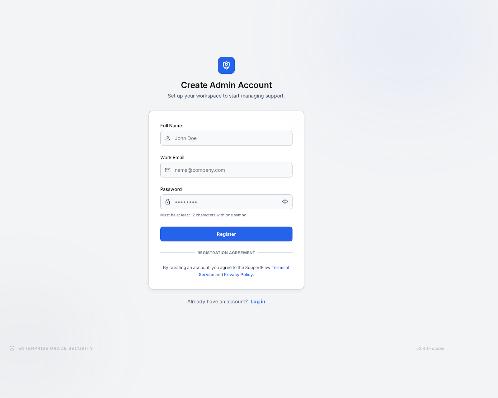

# Project Requirements — Customer Support Live Chat

## Overview

A real-time customer support chat application.
Visitors can start a chat anonymously. Logged-in admins manage and reply to chats from a dashboard.

**Tech Stack:** Astro (frontend) · Node.js + Express (backend) · Socket.io (real-time) · Tailwind CSS

---

## User Types

| User | Auth required | Description |
|---|---|---|
| Visitor | No | Any anonymous user who opens the chat page |
| Admin | Yes (session cookie) | Support agent who manages chats from the dashboard |

---

## Pages

| Route | Page | Access |
|---|---|---|
| `/` | Visitor chat page | Public |
| `/admin/register` | Admin register | Public |
| `/admin/login` | Admin login | Public |
| `/admin/dashboard` | Admin dashboard | Protected (admin only) |

---

## Feature Requirements

### 1. Visitor Chat Page (`/`)


- [ ] Display a chat widget on the page
- [ ] Generate a random session ID (e.g. `visitor_a3f9`) on first visit and store it in `localStorage`
  - On page load, check `localStorage` for an existing `visitorId`
  - If not found → generate a new random ID and save it to `localStorage`
  - If found → reuse the existing ID
  - This means the same visitor gets the same ID across page reloads (until `localStorage` is cleared)
- [ ] Send the session ID with every Socket.io connection to identify the visitor
- [ ] Display the visitor as **"Visitor #a3f9"** (short session ID) on the admin dashboard
- [ ] Visitor can type and send messages
- [ ] Visitor receives admin replies in real-time
- [ ] Show status message: "Connecting you to an agent..."
- [ ] Show "Chat has ended" when admin closes the chat

### 2. Admin Register (`/admin/register`)



- [ ] Admin can create an account with name, email, and password
- [ ] Password is hashed before being stored in server memory
- [ ] After successful registration, redirect to `/admin/login`
- [ ] Show an error if the email is already taken

### 3. Admin Login (`/admin/login`)


- [ ] Admin can log in with email + password
- [ ] Session is created using a session cookie
- [ ] Admin can log out (session is destroyed)
- [ ] All `/admin/*` routes redirect to `/admin/login` if not authenticated

### 4. Admin Dashboard (`/admin/dashboard`)


- [ ] Show the logged-in admin's name in the bottom-left of the sidebar (next to the logout button)
- [ ] Show a list of active (open) chats
  - Display: visitor ID (e.g. "Visitor #a3f9"), latest message preview, timestamp
- [ ] Admin clicks a chat to open and read the full message history
- [ ] Admin can type and send a reply in real-time
- [ ] Admin can close a chat (status changes from `open` → `closed`)
- [ ] Closed chats are removed from the active queue
- [ ] New incoming chats appear in the queue instantly (no page refresh)

---

## Real-Time Architecture (Socket.io)

### Overview

The frontend sends all data mutations (start chat, send message, close chat) via **REST API**.
The backend processes each request, updates the in-memory data, and then **broadcasts a Socket.io event** to notify other connected clients in real-time.

```
Frontend  ──── REST request ──────→  Backend
                                         │
                                         ├─ updates in-memory data
                                         │
                                         └─ emits Socket.io event ──→  Other clients
```

- **REST** — used for all data mutations
- **Socket.io** — used for server-to-client push notifications only

---

### Connection Events (Client → Server, on page load)

When a client first loads the page, it establishes a Socket.io connection and identifies itself so the backend knows which room to broadcast to.

| Event | Sent By | Payload | Purpose |
|---|---|---|---|
| `visitor:join` | Visitor | `{ visitorId, chatId }` | Join the visitor's specific chat room |
| `admin:join` | Admin | `{ adminId }` | Join the admin broadcast room |

---

### Push Notification Events (Server → Client)

After the backend processes a REST request, it emits one of the following events to notify the relevant clients.

| Event | Sent To | Trigger | Payload |
|---|---|---|---|
| `chat:new` | Admin dashboard | Visitor starts a new chat | `{ chatId, visitorId, createdAt }` |
| `message:new` | Admin or Visitor | Either side sends a message | `{ chatId, from, text, time }` |
| `chat:closed` | Visitor | Admin closes the chat | `{ chatId }` |

---

## Out of Scope (Intentionally Excluded)

- Landing page / marketing hero section
- Analytics page
- Team management page
- Canned responses
- Broadcast feature
- Visitor IP / location lookup (ip-api.com)
- Reports section
- Transfer chat between admins

---

## Optional (Add Only If Time Allows)

- [ ] "Agent is typing..." indicator (Socket.io)
- [ ] Show visitor IP address to admin as extra context (via `socket.handshake.address`)
- [ ] Visitor location via `ip-api.com`
- [ ] Unread message badge on admin dashboard

---

## API Endpoints

See `docs/api.md` for the full API design.

---

## Project Priorities

1. Project setup and repo structure
2. Admin register + login + logout (session cookie auth)
3. Protected routes for `/admin/*`
4. Visitor chat page + chat widget UI
5. Admin dashboard UI (chat list + chat panel)
6. Socket.io real-time messaging
7. UI polish and responsive design
8. Testing and presentation preparation
